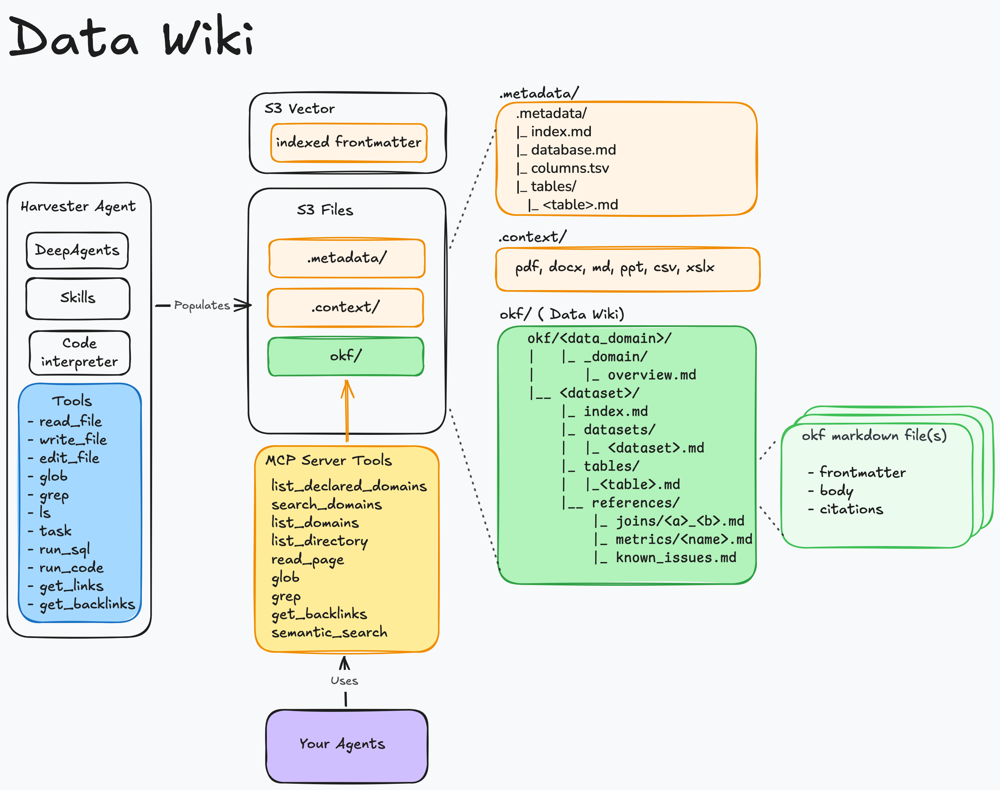
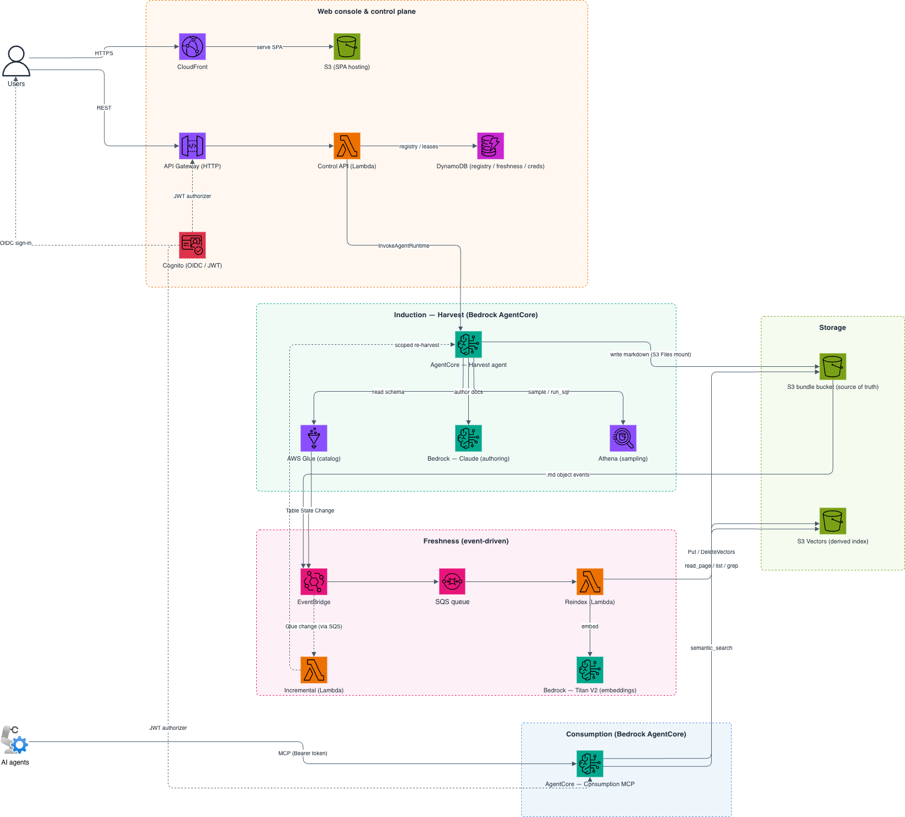

# Data Wiki: AI-powered knowledge bundles for your AWS data, served to agents over MCP

[](https://bundledex.net)

**Data Wiki** turns your AWS data sources into portable knowledge bundles and serves them to AI agents over the Model Context Protocol (MCP). It reads a source's catalog, has an LLM author a set of markdown documents describing each dataset — its tables, joins, metrics, and known issues — keeps those documents in sync as the source changes, and exposes them to agents through an MCP server. The result: agents that understand *what your data means*, not just what columns exist.

Two source types are supported today: the **AWS Glue Data Catalog** (queried via Amazon Athena) and **Amazon Redshift** (provisioned clusters or Serverless, via the Redshift Data API). The architecture is source-pluggable — see [`docs/DATA_SOURCES.md`](./docs/DATA_SOURCES.md) for how a source is implemented and how to add another.

The bundles are Open Knowledge Format (OKF) bundles — a bundle is a directory of markdown files with YAML frontmatter. Data Wiki maps OKF's model onto AWS as `data domain → dataset → table` (a dataset is a Glue database or a Redshift database). The `okf`/`OKF_` prefix on code identifiers, resource names, and env vars refers to the format, not the product.


**Note:** This is a sample implementation provided for educational and demonstration purposes. You should review, test, and customize this code for your specific requirements before deploying to any environment.

---

## Quick Links

- 📚 [Using the Console](./quick-start-guide/using-the-console.md) — register a dataset, harvest, and browse a bundle
- 🔌 [Connect an Agent (MCP)](./quick-start-guide/connect-an-agent.md) — mint credentials and query bundles from your agents
- 🚀 [Getting Started](#getting-started) — prerequisites and one-command deploy
- 🏗️ [Architecture](./docs/ARCHITECTURE.md) — how the pieces fit and the reasoning behind them
- 🔗 [Data Sources](./docs/DATA_SOURCES.md) — the Glue + Redshift sources and how to add another
- 📐 [Conventions](./docs/CONVENTIONS.md) — the contract between services (S3 layout, DynamoDB shapes, env vars)
- 📘 [API Reference](./docs/API_REFERENCE.md) — external API shapes the code was written against
- 📊 [Benchmark](./benchmark/mini_dev/) — BIRD mini_dev text-to-SQL evaluation (EX 74.0, [report PDF](./benchmark/mini_dev/OKF_mini_dev_report.pdf))

---


## Features

- **Automated Induction** - An AI agent reads your source catalog (Glue or Redshift), samples real data, and authors a knowledge bundle describing tables, joins, metrics, and known issues — in the source's own SQL dialect and type vocabulary.
- **Pluggable Data Sources** - Harvest from the AWS Glue Data Catalog (via Athena) or Amazon Redshift (via the Redshift Data API); a Redshift mapping is self-describing, so any cluster/workgroup in the account is selectable in the console. The source layer is an extensible seam for adding more.
- **Grounded in Your Docs** - Attach your own source documents (DDL, data dictionaries, runbooks, specs) so the bundle reflects your organization's knowledge, not just the raw schema.
- **Self-Healing Freshness** - Glue catalog changes automatically trigger scoped re-harvests, and the semantic search index stays in sync with the bundle on every write. (The event-driven path is Glue-only; Redshift datasets refresh via full/scheduled harvests.)
- **Served Over MCP** - Any MCP-capable agent can discover, read, and semantically search your bundles with `list_domains`, `list_directory`, `read_page`, `glob`, `grep`, `get_backlinks`, and `semantic_search`.
- **Machine Credentials** - Mint scoped OAuth2 credentials so applications and agents can call the MCP server programmatically.
- **Web Console** - Register datasets, upload context docs, run and watch harvests, browse bundles, and explore the link graph from a React UI.

---

## Benchmark

Does an OKF bundle carry enough about a database for an agent to answer real analytical questions — without ever seeing the schema? We tested this on [BIRD mini_dev](https://github.com/bird-bench/mini_dev), 500 curated text-to-SQL questions across 11 databases, using the official bird-bench grader on the original SQLite databases.

An agent whose *only* knowledge source was the OKF wiki (read over MCP, ~4.5 reads per question) scored **EX = 74.0** — above every published leaderboard entry — reconstructing every table, column, join, and value format from the bundle alone.

| | EX (Execution Accuracy) |
|---|---|
| **agent + OKF wiki** | **74.0** |
| TA + GPT-4o (best published) | 63.0 |
| GPT-4 | 47.8 |

Full methodology, per-database breakdown, and operational KPIs (tool usage, agent duration) in the [benchmark report (PDF)](./benchmark/mini_dev/OKF_mini_dev_report.pdf) and the [detailed results](./benchmark/mini_dev/RESULTS.md). The benchmark is fully reproducible from this repo — see [`benchmark/mini_dev/`](./benchmark/mini_dev/).

---

## Architecture

<p align="center">
  
</p>

### Solution Architecture

<p align="center">
  
</p>

**AWS Services Used:**

- Amazon S3 (bundle storage) and S3 Vectors (semantic index)
- AWS Glue + Amazon Athena and/or Amazon Redshift (source catalogs + data sampling)
- Amazon Bedrock (Claude for induction, Titan V2 for embeddings)
- Amazon Bedrock AgentCore Runtime (harvest + consumption MCP)
- AWS Lambda (Control API, reindex, incremental)
- Amazon API Gateway (HTTP API) and Amazon Cognito (auth)
- Amazon EventBridge + Amazon SQS (event-driven freshness)
- Amazon DynamoDB (registry, freshness, credentials)
- Amazon CloudFront (SPA delivery)

### Repository Layout

```
data-wiki/
├── services/
│   ├── okf_core/        # pure-Python OKF primitives (no AWS or agent deps)
│   ├── okf_aws/         # shared boto3 helpers: Titan embed, S3 Vectors, S3 keys
│   ├── harvest/         # induction: deepagents agent on AgentCore
│   ├── reindex/         # freshness: S3 events → S3 Vectors Lambda
│   ├── incremental/     # Glue change → scoped re-harvest + nightly reconcile
│   ├── control_api/     # Cognito-authed REST (API GW + Lambda)
│   └── consumption_mcp/ # streamable-HTTP MCP server on AgentCore
├── infra/
│   ├── durable/         # S3 buckets, S3 Vectors index, Cognito, DynamoDB
│   ├── compute/         # Lambdas, API GW, AgentCore runtimes + IAM, EventBridge/SQS, CloudFront
│   └── modules/lambda/  # reusable zip-Lambda + least-privilege role
├── ui/                  # React SPA (JS), shadcn/ui + Tailwind, Cognito OIDC
├── okf-mcp/             # Claude Code plugin: connect an agent to the MCP server
├── scripts/             # run_tests.sh, build_lambdas.sh, deploy.sh
├── quick-start-guide/   # task-oriented guides for using the console
└── docs/                # ARCHITECTURE.md, CONVENTIONS.md, DATA_SOURCES.md, API_REFERENCE.md
```

See [`docs/ARCHITECTURE.md`](./docs/ARCHITECTURE.md) for how the pieces fit together and the reasoning behind the main decisions.

---

## Getting Started

### Prerequisites

**Required Tools:**

The following tools must be installed on your local machine:

- [AWS CLI](https://docs.aws.amazon.com/cli/latest/userguide/getting-started-install.html) configured with [appropriate credentials](https://docs.aws.amazon.com/cli/latest/userguide/cli-configure-files.html)
- [Terraform CLI](https://developer.hashicorp.com/terraform/install)
- [Docker](https://docs.docker.com/engine/install/) running (with `buildx` for ARM64 image builds)
- [Node.js](https://nodejs.org/en/download) and npm
- [Python](https://www.python.org/downloads/) (v3.12 or later)
- [jq](https://jqlang.org/download/)

**AWS Setup:**

- A **pre-created, versioned S3 bucket** for Terraform state (the deploy uses split state and won't create this for you).
- **Amazon Bedrock model access** enabled in your region for the Claude induction model and Amazon Titan Text Embeddings V2. Follow the instructions [here](https://docs.aws.amazon.com/bedrock/latest/userguide/model-access.html); without access you'll get an `AccessDeniedException` during a harvest.
- A **data source** with tables to harvest — at least one **AWS Glue database**, and/or an **Amazon Redshift** cluster/workgroup. Redshift support is off by default; enable it with `TF_VAR_enable_redshift=true` before deploying `compute` (see [`docs/DATA_SOURCES.md`](./docs/DATA_SOURCES.md)). Each Redshift mapping supplies its own connection (cluster/workgroup + a Secrets Manager secret) in the console, so no per-cluster deploy config is needed. The secret must hold a **read-only DB user** (Redshift SQL runs with that user's privileges) and be named with the `okf-` prefix by default (`var.redshift_secret_name_prefix`) — the IAM grants are scoped to that pattern.

> **Note:** S3 Vectors and Bedrock AgentCore Runtime are used by this stack. Verify they are available in your target region before deploying.

### Installation and Deployment

1. **Clone the Repository**

```bash
git clone <your-repo-url>
cd sample-okf-llm-wiki

```

2. **Authenticate to AWS**

```bash
# Option I: Export AWS temporary credentials
export AWS_ACCESS_KEY_ID="your_temp_access_key"
export AWS_SECRET_ACCESS_KEY="your_temp_secret_key"
export AWS_SESSION_TOKEN="your_temp_session_token"
export AWS_DEFAULT_REGION="your_region"

# Option II: Export AWS Profile
export AWS_PROFILE="your_profile_name"
```

3. **Run the deployment**

```bash
./scripts/deploy.sh            # full pipeline (prompts on first run)
```

On the **first run**, you'll be prompted for:

- The AWS **region**
- The **Terraform state bucket** name (pre-created, versioned)
- The **initial admin user** (email and name)

These are saved to `scripts/.deployment.config` and reused on subsequent runs. The deploy then runs all five stages: push the container images, apply both Terraform stacks, wire the CloudFront URL into Cognito, and sync the SPA.

> **Note:** The admin user is created in the Cognito User Pool from your inputs; Cognito emails a temporary password to that address.

### Accessing the Console

After a successful deploy, print the deployed URLs:

```bash
./scripts/deploy.sh summary
```

Open the CloudFront URL, sign in with the admin credentials from your email, and follow [Using the Console](./quick-start-guide/using-the-console.md) to register your first dataset and run a harvest.

---

## Configuration Options

### Deploy Stages

`deploy.sh` orchestrates the full pipeline, but each stage can be run on its own — useful for iterating on one layer without re-running everything:

```bash
./scripts/deploy.sh <durable|images|compute|cognito-urls|ui|summary|destroy>
```

| Stage          | What it does                                                                 |
| -------------- | ---------------------------------------------------------------------------- |
| `durable`      | S3 buckets, S3 Vectors index, Cognito, DynamoDB (the long-lived stack).      |
| `images`       | Build and push the harvest + consumption container images to ECR.            |
| `compute`      | Lambdas, API Gateway, AgentCore runtimes, EventBridge/SQS, CloudFront.       |
| `cognito-urls` | Re-apply the durable stack to inject the CloudFront URL into Cognito.        |
| `ui`           | Build the React SPA and sync it to S3 / CloudFront.                          |
| `summary`      | Print the deployed URLs.                                                     |
| `destroy`      | Tear everything down (prompts for confirmation).                             |

A few things the deploy handles that would otherwise be manual:

- The harvest runtime's **VPC** (2 private subnets + NAT) is auto-provisioned, since S3 Files mounts require VPC networking. Bring your own with `TF_VAR_harvest_vpc_subnet_ids` / `TF_VAR_harvest_vpc_security_group_ids`.
- The **S3 Files** file system, mount target, and access point are managed by Terraform and mounted at `/mnt/data`.
- The Cognito **callback/logout URLs** get the CloudFront URL through the `cognito-urls` re-apply, not the console.
- Image URIs and the CloudFront URL flow between stages via `.deployment.config` and Terraform outputs.

### Connecting Agents (MCP)

Once bundles are harvested, agents consume them over the MCP server. Mint a machine credential in the console's **Credentials** view, then connect:

- **From Claude Code** — use the bundled [`okf-mcp`](./okf-mcp/) plugin, which handles token refresh automatically.
- **From any MCP client** — exchange your credential for a bearer token at the Cognito token endpoint and call the runtime directly.

See [Connect an Agent (MCP)](./quick-start-guide/connect-an-agent.md) for both paths.

### Local UI Development

To run the console against your deployed backend on `localhost`:

```bash
cd ui
npm run dev:env    # writes ui/.env.local from the compute stack outputs
npm install        # first run only
npm run dev        # http://localhost:5173
```

Port `5173` is whitelisted in Cognito for the OIDC redirect, so local dev works against the real deployed Cognito and Control API. See [`ui/README.md`](./ui/README.md) for details.

---

## Running the Tests

The suite runs entirely offline: `moto` mocks S3 and DynamoDB, and the remaining clients (s3vectors, bedrock-runtime, glue, athena, agentcore) are injected fakes. There are no live AWS calls.

```bash
python3 -m venv .venv && source .venv/bin/activate
pip install -e services/okf_core -e services/okf_aws         # shared libs
pip install -e services/harvest -e services/reindex -e services/incremental \
            -e services/control_api -e services/consumption_mcp --no-deps
pip install pytest "moto[s3,dynamodb]" "markdown-it-py>=3.0"
./scripts/run_tests.sh          # unit tests + the offline end-to-end harvest test

cd ui && npm ci && npm run build
cd ../infra/durable && terraform init -backend=false && terraform validate
cd ../compute && terraform init -backend=false && terraform validate
```

`tests/test_e2e_harvest_offline.py` drives the non-LLM half of the harvest pipeline end to end (Glue source → guard engine → link-graph impact analysis → `finalize_bundle`) against a fake F1-shaped Glue/Athena source and asserts the output is a valid OKF bundle. Actual Bedrock calls, S3 Vectors queries, and AgentCore hosting need a real account and aren't exercised here.

---

## Clean Up

To tear down everything the deploy created:

1. **Export AWS credentials** (same as the deploy step above).

2. **Run the destroy stage:**

```bash
./scripts/deploy.sh destroy
```

This tears down both Terraform stacks (durable and compute). The Terraform **state bucket** you pre-created is not managed by the deploy — remove it manually if you no longer need it.

> **Warning:** This permanently deletes the harvested bundles, the vector index, and all registry/credential state. The underlying source data (Glue databases, Redshift clusters) is not touched.

---

## Contributing

See [CONTRIBUTING](./CONTRIBUTING.md) for more information.

## License

This project is licensed under the MIT License. See the [LICENSE](./LICENSE) file.

## Authors

The following authors have contributed this sample within AWS and prepared it for open-source release:

- [Edvin Hallvaxhiu](https://github.com/edvinhallvaxhiu)
- [Aubrey Oosthuizen](https://github.com/a13zen)
- [Rahul Shaurya](https://github.com/shauryarahul)
- [Sindi Cali](https://github.com/scali123)
- [Shukhrat Khodjaev](https://github.com/khodjaevsh)
- [Ravi Kiran Ganji](https://github.com/RaviGanjiAWS)

Special thanks to [Bruno Dhefto](https://github.com/dhefto) for his thorough review and suggestions that helped improve the solution.