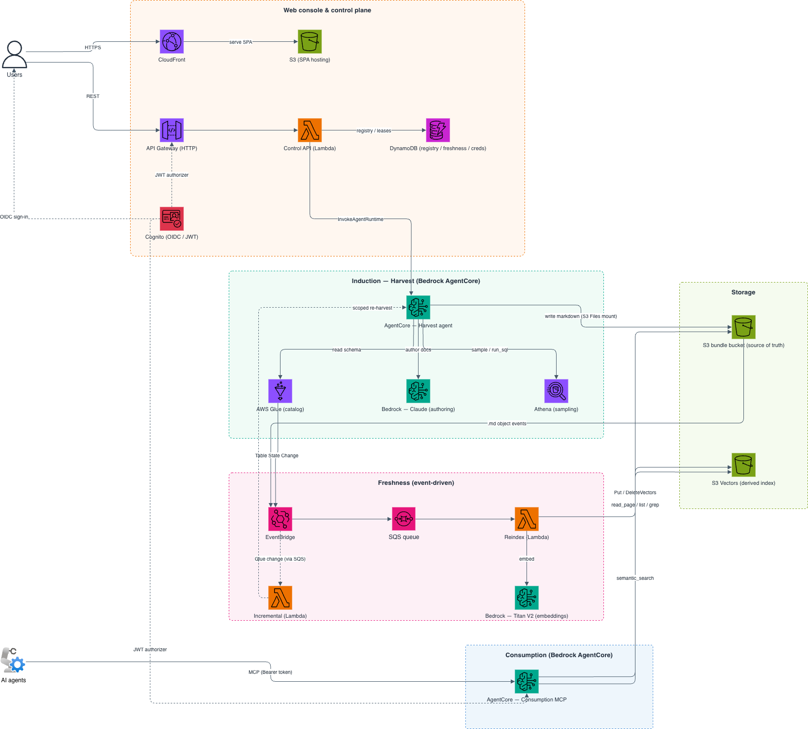

# Architecture

Data Wiki separates durable data, compute services, and the web console. Terraform manages the deployed resources.

## Main components

| Layer | Component | Purpose |
| --- | --- | --- |
| Web | React console on Amazon CloudFront | Manage domains, harvests, chat, and bundles |
| API | Amazon API Gateway and AWS Lambda | Provide authenticated control operations |
| Authoring | AgentCore harvest runtime | Inspect sources and author bundle pages |
| Chat | AgentCore chat runtime | Answer questions with wiki context |
| Consumption | AgentCore MCP runtime | Serve bundles to external agents |
| Storage | Amazon S3 and DynamoDB | Store bundles, state, reports, and indexes |
| Search | Amazon S3 Vectors | Find concepts by meaning |
| Freshness | EventBridge, SQS, and Lambda | Process source and bundle changes |

## Storage boundaries

The versioned bundle bucket is the source of truth. The vector index is derived from Markdown objects in the live bundle prefix.

Harvest scratch data stays separate from published pages. Benchmark artifacts also use a separate prefix.

## Authentication

Human users sign in through Amazon Cognito. API Gateway validates their JSON Web Tokens.

Machine consumers use OAuth 2.0 client credentials. The MCP runtime validates the resulting bearer token.

## Source access

AWS Glue harvests use Athena for evidence queries. Their roles can read the catalog and configured table data.

Some Glue data permissions cover broad read-only resources. Review the generated IAM policy before production use.

Amazon Redshift harvests use the Redshift Data API. Each mapping names its connection and secret.

Redshift SQL runs with the database user's privileges. Use a dedicated, read-only user with access to only the required data.

## Publishing

Full harvests write directly to the live bundle prefix. They delete prior authored output before rebuilding it.

Publication is not atomic. The console and MCP clients can observe partial content while a harvest runs.

Review and lint findings do not block publication. A failed or cancelled run can also leave partial live content.

The completion marker records a run that reached the complete state. Use version history to inspect or restore the last completed content.

## Next step

Learn about [bundles and freshness](bundles-and-freshness.md).
