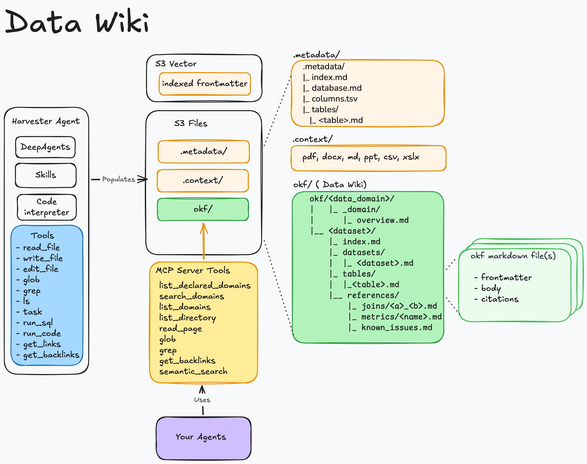

# Data Wiki

Data Wiki creates portable knowledge bundles for your AWS data. It serves those bundles to people and AI agents.

The service reads source metadata, samples data, and authors linked Markdown pages. Those pages collectively explain tables, joins, metrics, and known issues.

This guide is for Data Wiki operators, data owners, and agent developers.

## What you can do

- Group related datasets into data domains.
- Register AWS Glue or Amazon Redshift data sources.
- Add source documents that explain business meaning.
- Run harvests that author and review knowledge bundles.
- Browse bundle pages and their relationship graph.
- Ask questions through the built-in chat experience.
- Connect external agents through Model Context Protocol (MCP).
- Benchmark how well a wiki supports real questions.

!!! important
    Data Wiki is a sample implementation. Review its security, cost, and operational settings before production use.

## Start here

1. Review the [prerequisites](getting-started/prerequisites.md).
2. [Deploy Data Wiki](getting-started/deploy.md).
3. [Run your first harvest](getting-started/first-harvest.md).
4. [Connect an agent](user-guide/connect-an-agent.md).

## Common tasks

- [Manage domains and datasets](user-guide/domains-and-datasets.md)
- [Add context documents](user-guide/context-documents.md)
- [Run and review harvests](user-guide/harvests.md)
- [Browse a bundle and use chat](user-guide/browse-and-chat.md)
- [Configure a data source](configuration/data-sources.md)
- [Troubleshoot a problem](troubleshooting.md)

